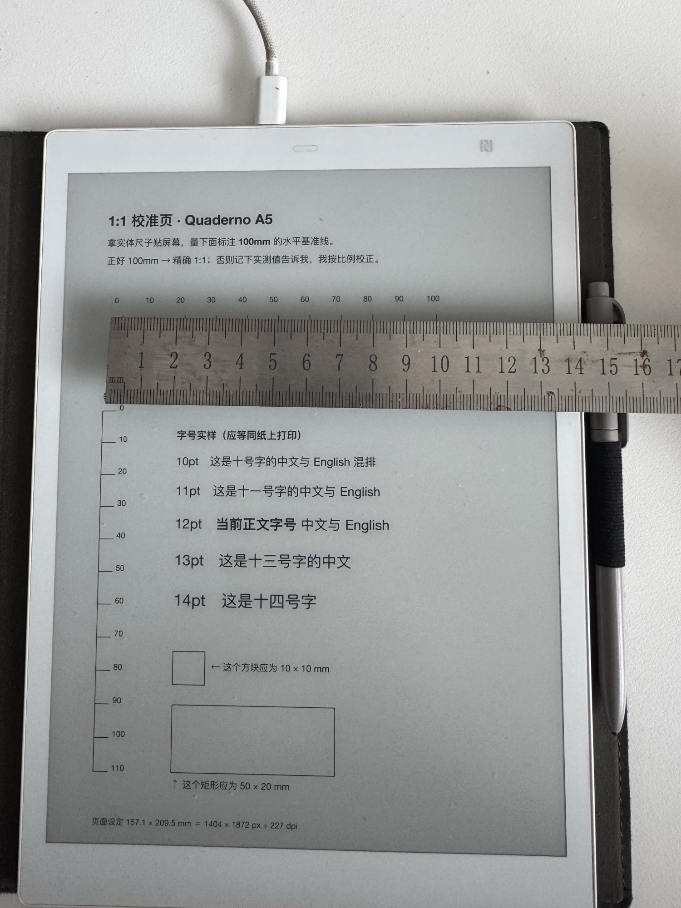

# 【网页文本稿】电子墨水设备显示区物理尺寸测定

> 交付说明：本文件是**可直接上站的页面文案**。
> 方括号 `[ ]` 内为给建站者的结构指示，不上页面。
> 结构按 H2 分块，将来若拆成「方法」与「数据」两页，可沿 H2 无痛切分。

---

[页面路径建议] `/lab/eink-display-metrics`

[SEO — <title>]
电子墨水设备显示区物理尺寸测定法 —— QUADERNO A5 / A4 实测数据 | 阅读岛

[SEO — meta description]
厂商只公布像素与对角线，不公布毫米。本文给出一套推导加实测的测定方法，并公布 QUADERNO A5（156.97×209.30mm）与 A4 的显示区物理尺寸，附可下载的 1:1 校准页。

[SEO — 关键词覆盖]
quaderno 屏幕尺寸 / 1404x1872 / 电子墨水 PDF 模糊 / 墨水屏排版 / e-ink 1:1 显示

---

[H1]
# 电子墨水设备显示区物理尺寸测定

[副标题 / 导语]
厂商规格书只公布**像素数**与**对角线英寸**，从不公布显示区的**毫米尺寸**。
但对任何要在墨水屏上做排版的人，毫米才是唯一有意义的单位。

本文给出一套「推导 + 实测验证」的测定方法，公布 QUADERNO 两款机型的数据，
并提供可直接下载的校准页 —— 你可以用它测定手上的任何一台墨水屏设备。

---

[H2 — 结论前置。此区块建议做成醒目卡片，放在首屏]
## 结论

| 机型 | 屏幕 | 分辨率 | 像素密度 | 显示区物理尺寸 | 宽高比 | 状态 |
|---|---|---|---|---|---|---|
| QUADERNO A5<br>(FMVDP51) | 10.3″ | 1404 × 1872 | 227.18 ppi | **156.97 × 209.30 mm** | 0.7500 | ✅ 已实测 |
| QUADERNO A4<br>(FMVDP41) | 13.3″ | 1650 × 2200 | 206.77 ppi | **202.69 × 270.26 mm** | 0.7500 | ⚠️ 推导值，待实测 |

两款设备的宽高比都精确等于 **3:4（0.7500）**，而非 ISO 纸张的 0.707。
这一条决定了排版策略 —— 详见下文。

[CTA 按钮，与上表并列]
[ 下载 1:1 校准页 PDF ]  ← 链接到 A5 / A4 两个版本

---

[H2]
## 一、为什么这个数字重要

墨水屏阅读器显示 PDF 时，默认会**把整页缩放到适配屏幕**。也就是说：

> 屏幕上的实际字号 ＝ 设定字号 × （屏幕物理宽度 ÷ 页面物理宽度）

如果你按常规习惯输出 A4 页面（210 mm 宽），投到 A5 机型（157 mm 宽）：

```
缩放比 = 156.97 ÷ 210 = 0.748
设定 11pt  →  屏幕上实际只有 8.2pt
```

**字被缩掉了四分之一，而你完全无从察觉。**
你只会觉得「这屏幕不如别人的清晰」——但问题不在屏幕，在页面尺寸错配。

反之，若页面尺寸与显示区完全相同，缩放比为 1.000，即 **1:1 显示**：

> 此时 PDF 里的 10pt，就是屏幕上物理意义的 10pt，
> 与你在纸上打印出来的 10pt 完全等大。

这不只是让字变大。更重要的是**排版从此有了确定的物理基准**，
可以像设计印刷品一样设计屏幕上的内容。

---

[H2]
## 二、推导方法

厂商公布的两个数字，足以反推一切：

1. **分辨率** `W × H`（像素）
2. **屏幕对角线** `D`（英寸）

三步推导：

```
① 对角线像素数     Dpx = √(W² + H²)
② 像素密度         ppi = Dpx ÷ D
③ 显示区物理尺寸   宽 = W ÷ ppi × 25.4  (mm)
                   高 = H ÷ ppi × 25.4  (mm)
```

以 QUADERNO A5 为例：

```
① Dpx = √(1404² + 1872²) = √5,475,600 = 2340 px
② ppi = 2340 ÷ 10.3″ = 227.18 ppi
③ 宽 = 1404 ÷ 227.18 × 25.4 = 156.97 mm
   高 = 1872 ÷ 227.18 × 25.4 = 209.30 mm
```

[H3]
### 这套推导可以当场自证

富士通官方另行标注 A5 机型为 **227 ppi**。
而我们从对角线独立反推得到 **227.18 ppi** —— 两者吻合，误差 0.08%。

> 推导路径与官方数据在一个独立维度上交叉验证通过，
> 因此同法用于未标注 ppi 的 A4 机型，结果是可靠的。

[H3]
### 第二重验证：边框是否合理

用机身外形尺寸减去推导出的显示区，得到边框宽度，应落在合理范围内：

| 机型 | 机身外形 | 推导显示区 | 左右边框（每侧） | 上下边框（合计） |
|---|---|---|---|---|
| A5 | 173.2 × 242.5 mm | 156.97 × 209.30 mm | 8.11 mm | 33.20 mm |
| A4 | 222.8 × 301.1 mm | 202.69 × 270.26 mm | 10.05 mm | 30.84 mm |

两款设备边框均在 8–10 mm 量级，上下略多（容纳下巴与传感器），
符合这类设备的工业设计常态。

若推导有误（比如误用了对角线或分辨率），这里会立刻出现负值或荒谬值 ——
**这是一道免费的自检**。

---

[H2]
## 三、实测验证：1:1 校准页

推导终究是推导。要把它变成事实，方法很朴素 —— **打印一把尺子，用真尺子去量。**

[图片 1]

[图注] 钢尺直接贴在墨水屏表面，与页面上的印刷刻度并排比对。
[alt] 一把钢尺横放在 QUADERNO A5 电子墨水屏上，屏幕显示带毫米刻度的校准页

校准页包含五组要素：

- **100 mm 水平基准线**（10 mm 长刻度 / 5 mm 短刻度）
- **110 mm 垂直基准线** —— 用于检查横竖缩放比是否一致
- **四角裁切标记** —— 若设备裁边或留黑边，这四个角会缺失或内移
- **10×10 mm 与 50×20 mm 基准块** —— 交叉校验
- **多字号实样** —— 顺带确认真实观感

[图片 2]

[图注] 校准页完整版面。源码开放，换机型只需改两个常量。

[H3]
### 判读方式

| 实测结果 | 结论 | 处理 |
|---|---|---|
| 基准线正好 100 mm | 精确 1:1 | 推导值可直接采用 |
| 实测为 L mm | 存在缩放 | 页面尺寸各乘以 `100 ÷ L` |
| 四角标记缺失或内移 | 设备并非满屏适配 | 需另行补偿 |
| 横竖比例不一致 | 宽高比推导有误 | 复核分辨率数据 |

[H3]
### QUADERNO A5 实测结果

> **100 mm 基准线量得 100 mm，四角标记完整。**
> **该机型 PDF 显示为精确 1:1 —— 无缩放，无裁切。推导值成立。**

---

[H2 — 这一节是全文最反直觉、也最值得转发的部分]
## 四、清晰度取决于重采样，而不是 ppi

QUADERNO A5 只有 227 ppi，远低于现代手机屏。
但实现 1:1 之后，主观清晰度有显著提升。原因不在像素密度：

- **缩放显示时**，字形必须经过一次重采样。笔画落在像素网格的非整数位置上，
  字体的 hinting 全部失效，一根细竖会被摊成两列灰边 ——
  **这才是「发虚」的真正来源。**

- **1:1 显示时**，字形能够对齐像素网格，边缘干净锐利。

> **推论：220 ppi 的精确 1:1，观感优于 300 ppi 的带缩放显示。**
> 对墨水屏排版而言，消除重采样比堆像素密度更有效。

如果你一直觉得自己的墨水屏「不够清晰」，
在怀疑硬件之前，先检查页面尺寸是否与屏幕匹配。

---

[H2]
## 五、关键洞察：3:4 不等于 ISO 纸张

这是本次测定中最有工程价值的发现：

| 对象 | 宽高比 |
|---|---|
| QUADERNO A5 / A4 显示区 | **0.7500**（精确 3:4） |
| ISO A4（210 × 297） | 0.7071 |
| ISO A5（148 × 210） | 0.7048 |

**设备屏幕比 ISO 纸张更「宽」。** 后果是：

- 输出 ISO A4 / A5 页面时，即使缩放正确，
  **左右仍会留下约 6% 的黑边**，屏幕面积被白白浪费
- 只有按 3:4 出页，才能真正铺满屏幕

换句话说，「A4 / A5」是富士通的**产品型号名，不是纸张规格**。
这一点极易误导 —— 我们自己也是先踩了坑才发现。

---

[H2]
## 六、实际应用

确认 1:1 之后，排版就可以按物理量来设计。以 QUADERNO A5 为例的推荐参数：

| 参数 | 取值 | 理由 |
|---|---|---|
| 页面尺寸 | 157.1 × 209.5 mm | 即显示区，1:1 |
| 页边距 | 10 mm | 屏幕阅读无装订需求，窄边距换版心 |
| 正文字号 | 10 pt | 1:1 下即真实 10pt |
| 版心宽度 | 137.1 mm | 约 39 字/行 |

[H3]
### 1:1 带来的额外好处：字号可以「点菜」

因为是 1:1，**可以直接把字号菜单印出来看** —— 所见即所得，不必反复试错。

[图片 3]

[图注] 各字号在设备上的真实呈现。因为 1:1，屏幕上看到的就是最终大小。

各字号在 137.1 mm 版心下的行容量：

| 字号 | 字/行 | 参考 |
|---|---|---|
| 8 pt | ≈ 47 | 过密 |
| 9 pt | ≈ 42 | 偏密 |
| 10 pt | ≈ 39 | 信息密度优先 |
| 11 pt | ≈ 34 | 平装书常用 |
| 12 pt | ≈ 31 | 舒适 |
| 13 pt | ≈ 29 | 宽松 |
| 14 pt | ≈ 27 | 大字版 |

> 中文排版经验：行长以 25–40 字为宜。过长则回行时容易串行。

---

[H2 — 下载区，建议做成醒目区块]
## 下载校准页

用它测定你手上的设备，几分钟即可完成。无需安装任何软件，下载即用。

[按钮] QUADERNO A5 版校准页（PDF）
[按钮] QUADERNO A4 版校准页（PDF）
[链接] 校准页源码（typst，换机型只改两个常量）

**使用方法：**
1. 把 PDF 传到你的设备上打开
2. 拿实体尺子贴着屏幕，量那条标注 100 mm 的基准线
3. 对照上文「判读方式」表格

---

[H2 — 社区征集，本页的行动号召]
## 征集：你的设备数据

我们目前只有一台设备的实测数据。**这套方法对所有电子墨水设备通用** ——
reMarkable、BOOX、Kindle Scribe、以及 QUADERNO A4，都可以用同一张校准页测定。

如果你手上有设备，欢迎用上面的校准页量一次，把结果发给我们：

- **机型全名**（含型号，如 FMVDP51）
- **实测毫米值**
- **一张照片**（尺子贴在屏幕上的样子）

[联系方式占位 —— 邮箱 / 表单 / GitHub]

我们会把数据整理进公开的设备参数库，并署名贡献者。
**目标是建立一份开放的电子墨水设备物理参数库** —— 这是目前互联网上缺失的一块。

---

[H2]
## 待验证事项

我们坚持区分「实测」与「推导」，不含糊：

- ⚠️ **QUADERNO A4 的 202.69 × 270.26 mm 目前仍是推导值**，尚未实测。
  如果你有 A4 机型，你的一次测量就能把它转为已验证。
- ❓ 其他厂商设备均无数据，欢迎补充。

---

[页脚区块]

**数据来源**
- 富士通 QUADERNO 官方产品信息
- QUADERNO A5（FMVDP51）/ A4（FMVDP41）规格页

*显示区物理尺寸为本文推导并实测所得，非厂商公布数据。*

**授权**
本文数据以 CC0 发布 —— 可自由使用、修改、商用，无需署名。
我们希望它被尽可能广泛地使用。

**引用格式**
阅读岛《电子墨水设备显示区物理尺寸测定》，2026年7月18日，<页面URL>

**更新记录**
- 2026-07-18　首次发布。QUADERNO A5 实测验证；A4 推导值待验证。

---

[建站备注 — 不上页面]

1. 图片资产共三张，位于本仓库 `docs/assets/`：
   - quaderno-a5-ruler-verification.jpg（实测照片，1500×2000，533KB）
   - quaderno-a5-calibration-page.png（校准页版面）
   - quaderno-a5-font-menu.png（字号菜单）

2. 需准备的下载文件：
   - A5 校准页 PDF —— 已有，`docs/assets/quaderno-a5-calibration-page.pdf`
   - A4 校准页 PDF —— 需生成（改 calibrate.typ 顶部 PW/PH 为
     202.69mm / 270.26mm 后重新编译）

3. 「结论」表格与「下载校准页」两个区块建议做成视觉重点。
   访客中有相当比例只需要这两样，不会读完全文。

4. 若将来拆分为两页，切分线为：
   - 方法页：第一、二、三、四、五节
   - 数据页：结论表 + 第六节 + 征集 + 待验证

5. 英文版对触达全球开发者影响很大，建议作为独立事项立项。
